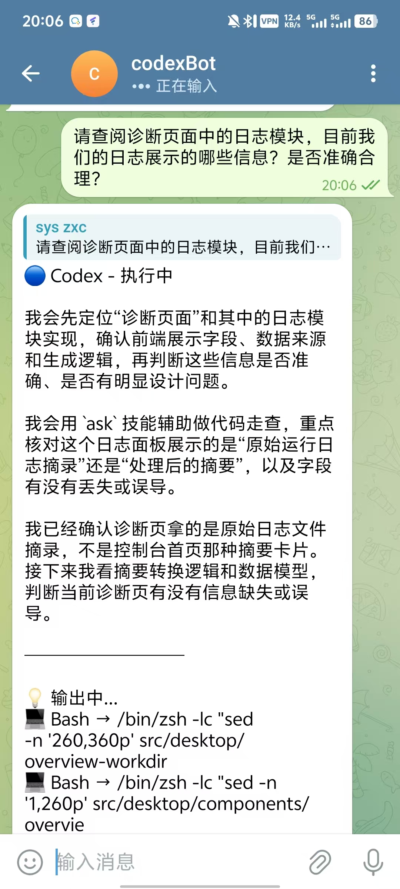

# RelayDesk

可信消息渠道到本地 AI 编码代理的桌面控制台。

RelayDesk 是一个基于 Tauri、React 和 Node sidecar 的本地桌面应用，用来把 Telegram、飞书、QQ、企业微信、钉钉、微信等消息入口接到本机 AI 编码工具，并通过统一桌面工作台完成配置、路由、运行和诊断。


## 它能做什么

- 把多个 IM 渠道接到本机 AI 工具
- 按默认规则或按渠道选择 Claude、Codex、CodeBuddy
- 以桌面应用方式运行，支持托盘、关闭隐藏、目录选择、路径打开
- 通过本地 sidecar 和 worker runtime 管理消息处理与会话连续性
- 在桌面端查看健康状态、探测结果、日志、诊断和近期会话


<p align="center">
  
</p>
<p align="center">
  
</p>

## 当前支持

### 渠道

| 渠道 | 当前状态 |
| --- | --- |
| Telegram | 生产级 |
| 飞书 | 生产级 |
| QQ | 生产级，有边界 |
| 企业微信 | 生产级 |
| 钉钉 | 生产级 |
| 微信 | 生产级，有边界 |

### AI 工具

- Claude
- Codex
- CodeBuddy

## 架构

RelayDesk 采用三层结构：

1. `Tauri Desktop Shell`
2. `Node Desktop API Sidecar`
3. `Bridge Worker Runtime`

主要目录职责：

- `src-tauri`：原生桌面壳层
- `packages/desktop-api`：桌面前端调用的本地 API
- `packages/application`：运行时编排
- `packages/channels`：各消息渠道接入
- `packages/agents`：AI 工具 adapter 和 CLI runner
- `packages/state`：配置、日志、服务控制、session 管理
- `src`：React 桌面工作台

## 快速开始

### 安装依赖

```bash
npm install
```

### 运行基础校验

```bash
npm run test
npm run build:web
cargo check --manifest-path src-tauri/Cargo.toml
```

### 启动桌面开发环境

```bash
npm run dev:desktop
```

## 配置

本地应用目录默认在：

```text
~/.relaydesk
```

主配置文件路径：

```text
~/.relaydesk/config.json
```

最小配置示例：

```json
{
  "aiCommand": "codex",
  "runtime": {
    "keepAwake": true
  },
  "logLevel": "info",
  "tools": {
    "codex": {
      "cliPath": "codex",
      "workDir": "/Users/you/workspace",
      "timeoutMs": 1800000,
      "idleTimeoutMs": 120000
    }
  },
  "platforms": {
    "telegram": {
      "enabled": true,
      "aiCommand": "codex",
      "botToken": "<telegram-bot-token>",
      "allowedUserIds": ["<allowed-user-id>"]
    }
  }
}
```


## 常用命令

```bash
npm run dev:web
npm run dev:desktop
npm run test
npm run build:web
```

## 仓库结构

```text
.
|-- packages/
|-- scripts/
|-- src/
|-- src-tauri/
|-- package.json
`-- vite.config.ts
```

## 许可证

[MIT License](./LICENSE)
